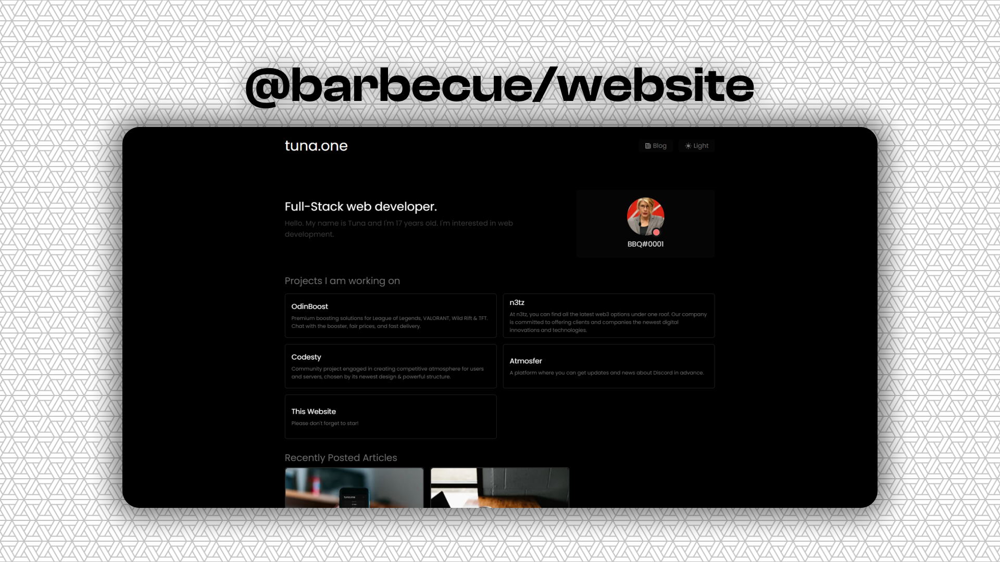

## 🍖 Barbecue's Website 

    

I have been developing myself in the frontend/backend field for almost 3 years and I have made a lot of websites for myself. However, I kept most of them simple, but in this website, I will try different things and share them with you as open-source because people can contribute to this project and benefit from this template.

### ❤️‍🔥 Features

- Real-time discord status from [Lanyard API](https://github.com/Phineas/lanyard/)
- Sections for introducing yourself
    - Your projects, a self-introduction text, known languages, programs etc., contact information.
- Spotify API to display your recently listened songs.
- MyAnimeList API to display your recenlty watched animes.
- Light & Dark theme support.
- PWA Support.

### 📝 To-Do
- [ ] GitHub Repositories section.
- [ ] Real-time discord playing status.
- [ ] Static Blog.
- [ ] A page where I can put my own small tools.
- [ ] The 'Support this website on GitHub' message that appears when you first enter the site.

### 🔧 Getting Started

- You will need to download Node.js (**Version should be above 16.11**) from https://nodejs.org/en/.

Next, use a package manager to download the packages:

- Yarn: `yarn install`
- Npm: `npm install `
- Pnpm: `pnpm install`

 
If you want the anime and Spotify features to work, you need to edit the `.env.example` file. After editing, rename it as `.env`.

To start in development mode:

- Yarn: `yarn run dev`
- Npm: `npm run dev`
- Pnpm: `pnpm run dev`

To build:

- Yarn: `yarn run build`
- Npm: `npm run build`
- Pnpm: `pnpm run build`

⚠️ P.S: You cannot run this website in static mode.